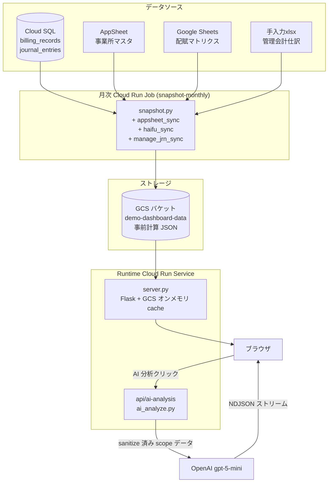
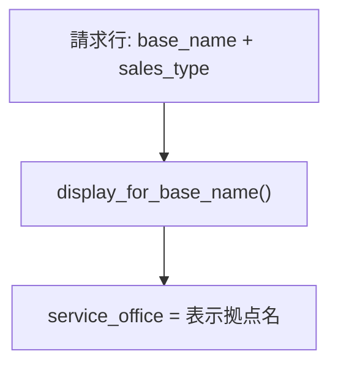
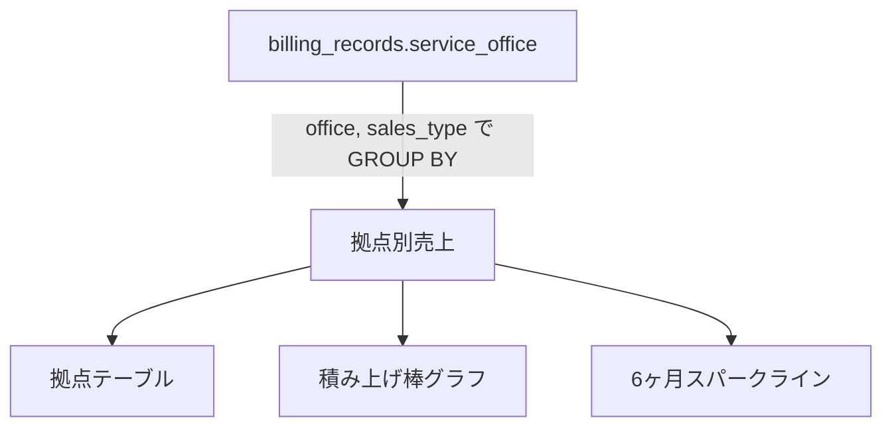
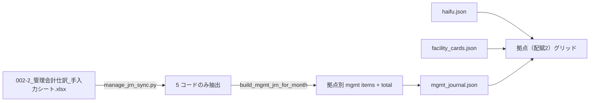
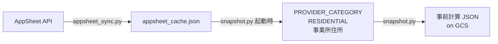

# 売上ダッシュボード — 開発者ガイド

> **Demo Changes**: このドキュメントはオリジナルの本番環境アーキテクチャを説明しています。デモ版では: データは `generate_demo_data.py` で生成（MySQL/AppSheet/Google Sheets 不要）、GCS バケットはオプション（ローカル `data/` がデフォルト）、OAuth は任意の Google アカウントで利用可能、AI 分析は DeepSeek API を使用。

## 概要

介護事業所向け売上・利用者・サービス別ダッシュボード。データは月次バッチで事前計算され、静的 JSON として保存される（本番: GCS、デモ: ローカル `data/`）。Flask アプリは JSON をオンメモリ cache から配るだけのシンプルな構成。



**設計の要点:** 完全自動化、手動オペレーションなし。Cloud Run Job + Cloud Scheduler により毎月 1 日にデータを更新。Runtime には DB を持たず、API レスポンスはすべて事前計算された静的 JSON をオンメモリから返す。`server.py` には AI 分析用ストリーミングエンドポイントも乗っており、同じオンメモリ store を読んで sanitize 済みの scope-restricted データを OpenAI に転送する。

### データソース

| ソース | 内容 | 利用箇所 |
|---|---|---|
| **MySQL** (billing-database) | `billing_records`（月次ロールアップ）+ `journal_entries`（仕訳明細） | snapshot.py（月次取得） |
| **AppSheet**（事業所マスタ） | 事業所・拠点・住所マスタ | appsheet_sync.py |
| **Google Sheets**（配賦マトリクス） | 月次の社内間配賦マトリクス | haifu_sync.py |
| **xlsx**（管理会計仕訳_手入力シート） | 手入力仕訳 — 5 つの売上コード（1650/2220/2240/2245/2299）。拠点（配賦2）タブ用 | manage_jrn_sync.py |
| **GCS**（demo-dashboard-data） | 事前計算 JSON | server.py（ランタイム読込） |
| **OpenAI API**（gpt-5-mini） | AI 分析（オンデマンド・ストリーミング） | ai_analyze.py / `/api/ai-analysis` |

### 売上の拠点帰属（service_office）

各請求行は `base_name` を `config.display_for_base_name()` で正規化し、表示拠点・エリアに変換される。`BASE_NAME_TO_OFFICE` は廃止（空 dict のレガシーエイリアスとして残置）— 名寄せはすべて関数経由。`service_office = 解決後の office_name` で確定し、再帰属は行わない。



**居住者判定** は `is_residential` カラム（snapshot 時に NFKC 正規化 + sales_type 部分一致で事前計算）。拠点 X の居住者 = `service_office=X` で居住系 sales_type の請求がある `person_id`。

---

## パネル

### KPI ヘッダー

| 指標 | 計算元 |
|---|---|
| 合計売上 | `SUM(credit_amount) WHERE service_office IS NOT NULL` |
| 保険 / 自費 | `debit_account` が `6115*` = 保険、`6120*` = 自費 |
| 非売上 | 0（`billing_records_data` 廃止により無効。UI には残るがサブラベルに「現在無効」と注記） |
| 利用者数 | 当月の `person_id` のユニーク数（活動利用者のみ自然に集計） |
| 拠点数 | 当月売上のある拠点数（`service_office` の DISTINCT） |

すべて月次 snapshot で算出し `{month}/kpi.json` に保存。

**整合性:** KPI 合計 = 拠点合計の和 = サービス合計の和。

---

### 拠点別請求

各拠点が **自身のサービスから稼ぐ実売上**（他法人経由の請求も拠点側に集計）。



- 多色棒グラフ：セグメント幅 = カテゴリ別売上シェア
- タグ：実請求データから自動抽出（CSM プロバイダー固定ではない）
- Y 軸：横スクロールに合わせて自動再スケール
- **単位切替**: `億 / 百万 / 万 / 千` の 4 chip（複数 ON 可）

### 拠点詳細モーダル

拠点別請求の行クリックで開く drill-down。すべてのセクションは上部のカテゴリ chip で絞り込み可能。

- **請求内訳** — 当拠点で billing が立った sales_type 別売上
- **推移チャート** — カテゴリ別積み上げ、直近 6 ヶ月
- **居住者の全サービス請求** — 居住者カード形式で **他拠点で受けたサービスも含めた全体像** を表示。**この金額は表示用のみ** で拠点合計には加算しない（拠点合計は billing ベースを正とするため）
- **当拠点で請求があった利用者** — サービス利用者テーブル（当拠点分のみの金額）
- **CSV ダウンロード** — 表示中の絞り込み込みでエクスポート
- **算出方法** — 介護保険制度の説明（折りたたみ）

### サービスタブ

全拠点を横断した `sales_type` 別売上。`config.SALES_TYPE_CATEGORY` で正確な辞書 lookup によりカテゴリ化（部分一致は使わない）。`{month}/services.json` に事前計算。

### 拠点（配賦）タブ

`journal_entries`（仕訳明細）を基にした拠点ビュー + 社内間配賦オーバーレイ。


- **カードモード**: 拠点ごとに 売上（fmt 由来）+ 社内間配賦セクション（流入＝緑+, 流出＝赤−）+ 配賦込み合計
- **チャートモード**: 配賦金額をマッチするサービスカテゴリに巻き取った積み上げ棒（例: `訪問介護（鹿）` の流入 → `訪問介護` 色に統合）
- **詳細モーダル**: 配賦行クリックで mute、合計サマリと推移チャートの「合計」ラインがリアルタイム再計算

さくら拠点の split はこの fmt パスでのみ実施。`config.BASE_SALES_TYPE_ROUTE` のキーワードマッチで `特定施設` → `さくら2`（介護付有料）、`認知症` → `さくら1`（認知症GH）に振り分ける。

### 拠点（配賦2）タブ

拠点（配賦）と同じデータ + **管理会計手入力仕訳** レイヤー。`billing_records` / `journal_entries` に乗らない 5 つの売上コードを表示する：

| コード | 名称 |
|---|---|
| 1650 | 福祉用具販売 |
| 2220 | リサーチ事業 |
| 2240 | 就労事業（食事提供） |
| 2245 | 就労事業（その他） |
| 2299 | 就労事業（食事・福岡） |



カードに「管理会計収入」セクションが追加。詳細モーダルでは各項目クリックで mute（社内間配賦と同じ挙動）、推移チャートの「合計」ラインも mute 状態を反映してライブ再描画。

管理会計仕訳にしか登場しない拠点（例: デモリサーチ（福岡） — `journal_entries` に行が無い）には合成プレースホルダーカードを生成する。

### 分析タブ

居住系拠点向けの保険利用率分析：
- サービス・金額からの推定介護度
- 保険未使用枠（支給限度額 − 実利用）
- 「算出方法」ノートで 4 種の保険体系を説明

---

## AppSheet 連携



**新規拠点が AppSheet に追加されたとき:**
1. 翌月 1 日の自動実行を待つ、または手動: `gcloud run jobs execute snapshot-monthly --region=asia-northeast1`
2. AppSheet 取得 → 新規住所のジオコーディング → 全 JSON 再生成
3. 新拠点が正しい住所と座標で自動表示
4. コード変更・再デプロイ不要

**利用しているテーブル:**

| AppSheet テーブル | 行数 | 用途 |
|---|---|---|
| 事業所 | 38 | 事業所名・ID |
| 拠点情報一覧 | 74 | 拠点の業態・サービス情報 |
| サービス種別 | 91 | 拠点別サービス種別と事業所番号 |
| 住所 | 39 | 建物名込みの正確な住所 |
| 提供事業 | 24 | サービス種別マスタ |
| サービス種別マスタ | 27 | 保険カテゴリ |

API キーは GCP Secret Manager に保存、Cloud Run で env 変数として mount。

---

## 主要マッピング（config.py）

| マッピング | ソース | 用途 |
|---|---|---|
| `display_for_base_name()` | `_NAME_OVERRIDES` + 正規化ロジック | base_name → (表示名, エリア) を関数で解決。**`BASE_NAME_TO_OFFICE` の後継** |
| `_NAME_OVERRIDES` | ハードコード | 旧名 → 新名のリネーム辞書（display_for_base_name 内で参照） |
| `BASE_SALES_TYPE_ROUTE` | ハードコード | sales_type → さくら1/さくら2 振り分け（fmt パス専用） |
| `PROVIDER_CATEGORY` | AppSheet + フォールバック | provider_name → ダッシュボードカテゴリ |
| `RESIDENTIAL` | AppSheet + フォールバック | 居住系 provider 種別 |
| `SALES_TYPE_CATEGORY` | ハードコード（43 件） | sales_type → カテゴリ（厳密 lookup） |
| `SERVICE_CODE_CATEGORY` | ハードコード（41 件） | service_code → カテゴリ |
| `BASE_NAME_TO_OFFICE` | 廃止（空 dict） | レガシーエイリアス。`display_for_base_name()` に移行済み |

これらは `config.py` に集約されており、`snapshot.py` の JSON 生成時のみ使用される。Runtime の `server.py` は事前計算結果を返すだけなので、これらの mapping は読み込まない。

---

## 整合性ルール

任意の月で常に成立すべき不変条件：

1. KPI 合計 = 拠点別請求の合計
2. KPI 合計 = サービス別売上の合計
3. 各拠点：拠点別請求の値 = 詳細モーダルの請求内訳合計 = 詳細モーダルの利用者合計（拠点単位 entity を除く）
4. 各拠点：タグ別小計の和 = 「全て」合計
5. KPI 拠点数 = 拠点別請求の表示件数

---

## 既知のギャップ

拠点タブ / 分析タブのベースライン（`billing_records` 由来）は会計帳簿より **約 3% 低い**。主因は **家賃データの欠落** と **就労事業の billing_records 部分カバレッジ**。拠点（配賦2）タブで管理会計手入力仕訳の 5 コード（福祉用具販売・リサーチ・就労 食事提供 等）をオーバーレイすることで大半を埋めている。残る家賃ギャップは MySQL 側のカバレッジ改善待ち。

---

## 月次自動パイプライン（Cloud Run Job）

| 項目 | 内容 |
|---|---|
| **Job 名** | `snapshot-monthly`（Cloud Run Job、2 vCPU / 4GB RAM） |
| **スケジュール** | 毎月 1 日 8:00 JST（Cloud Scheduler） |
| **実行時間** | 約 2 分 |
| **コスト** | 約 $0.01/月 |
| **MySQL 接続** | `mysql-connector-python` で読み取り専用接続（unix socket は環境変数で任意指定可） |
| **シークレット** | MYSQL_HOST/USER/PASSWORD/DATABASE、APPSHEET_API_KEY すべて Secret Manager |

**パイプライン段階:**
1. **AppSheet sync**（〜5s） — 事業所マスタ取得、新規拠点のジオコーディング
2. **Sheets sync**（〜5s） — 配賦マトリクス を取得、月別配賦マトリクスに parse
3. **xlsx 取込**（〜1s） — 管理会計手入力シートを読み、5 コードでフィルタ
4. **MySQL → SQLite**（〜15s） — `billing_records` + `journal_entries` をコピー、`is_residential` フラグ付与
5. **JSON 生成**（〜70s） — Flask test client で各 API を叩き、月別 15 種類前後のファイル（kpi / facilities_billing / services / persons / facility_details / facility_cards / facility_cards_detail / facility_trends / haifu / mgmt_journal / analysis / cross_sell / alerts / map / person_details）+ ルートに `months.json` / `trend_history.json` を生成
6. **GCS アップロード**（〜10s） — `gs://demo-dashboard-data/` に書き込み

**手動実行:** `gcloud run jobs execute snapshot-monthly --region=asia-northeast1`

**性能ノート:**
- SQLite は `PRAGMA journal_mode=MEMORY` + `synchronous=OFF`（使い捨てコンテナのためクラッシュセーフ性は不要）
- service_office 帰属はテンポラリテーブル経由のバッチ SQL（Python ループは使わない）
- `server_snapshot.py` は SQLite-backed の Flask アプリで、snapshot.py の test client から呼ばれる専用 server

---

## AI 分析エンドポイント

`POST /api/ai-analysis?{periodQuery}` — ストリーミング NDJSON。

**Scope（全 16 種）:**
- ヘッダー: `global`
- タブ: `tab:facilities`、`tab:facilities-compare`、`tab:analysis`、`tab:services`、`tab:persons`、`tab:history`、`tab:card-view`、`tab:card-view2`
- モーダル: `modal:facility`、`modal:card-detail`、`modal:card-detail2`、`modal:person`、`modal:care-level`、`modal:service-users`、`modal:fac-gap`

**リクエスト body:**
```json
{
  "scope": "<上記 16 種のいずれか>",
  "entity_id": "桜木拠点" | "要介護3" | null,
  "filters": {
    "categories":  [...],         // 複数選択 chip（tab:facilities, card-view*）
    "category":    "...",         // 単一選択（tab:services）
    "sort":        "total|avg",   // tab:services
    "q":           "...",         // tab:persons 検索
    "mode":        "category|facility",  // tab:history
    "selected":    [...],         // tab:facilities-compare 選択拠点
    "per_user":    true|false,    // tab:facilities-compare
    "y_axis":      "abs|rel",     // tab:facilities-compare
    "cat_mutes":   [...], "row_mutes": [...],
    "cust_mutes":  [...], "haifu_mutes": [...]
  }
}
```

**レスポンス（NDJSON、1 行 1 オブジェクト）:**
```json
{"type":"meta", "meta":"GPT-5 mini / 期間: 2026-03 / カテゴリ: 訪問介護", "cached":false}
{"type":"chunk", "text":"- 桜木拠点は配賦込み合計が..."}
{"type":"chunk", "text":"\n- 中央中央のスタッフ..."}
{"type":"done"}
```

パイプライン: `_get_store()` → `_ai_data_for_scope(scope, entity_id, months, filters)`（sanitize、store は非破壊）→ `_apply_filters()`（deepcopy 後に UI 側フィルタ状態を反映）→ `_translate_keys_to_ja()`（英語キー → 日本語）→ `ai_analyze.analyze_stream()`（OpenAI ストリーム）→ NDJSON でクライアントへ。

Cache: `(scope, entity_id, months, filters_hash)` をキーに 5 分 TTL。挿入時に期限切れエントリを eviction。Rate limit: 30 回/時/ユーザー。フロントエンドは UI フィルタ変更ごとに開いている AI パネルを破棄するので、古い結果が画面に残ることはない。

System prompt は起動時に `docs/AI_SYSTEM_PROMPT.md` から読込。Scope 別の観察ポイント（特に分析タブの推定介護度の相対性、3 グルーピング、廃止フィールド一覧）はそこに記述。**コード変更なしで挙動を更新**できる。

---

## ファイル構成

リポジトリは **runtime（Cloud Run Service）** と **snapshot job（Cloud Run Job）** の 2 系統が同居している。Dockerfile ごとに必要なファイルだけが image に COPY されるので、両者は物理ディレクトリで分かれているわけではなく **依存ファイルの集合で識別** する。

### Runtime — Cloud Run Service（`Dockerfile`）

ブラウザに見えるダッシュボード本体。GCS の事前計算 JSON を読み、AI 分析リクエストを OpenAI に転送する thin Flask アプリ。

| File | 用途 |
|---|---|
| `server.py` | Flask runtime — GCS バックエンド API（`/api/kpi`、`/api/facilities`、…）+ `/api/ai-analysis` ストリーミング。約 1900 行 |
| `gcs_store.py` | GCS オンメモリ cache。並列ロード + lazy TTL refresh、JSON 取得は dict lookup |
| `ai_analyze.py` | OpenAI ストリーミングラッパー。system prompt は起動時に `docs/AI_SYSTEM_PROMPT.md` から読込 |
| `index.html` | 単一ページフロントエンド（Chart.js / Lucide / 素の JS）。約 6000 行 |
| `about.html` | アーキテクチャ説明ページ（`/about`） |
| `favicon.svg` | Favicon |
| `docs/AI_SYSTEM_PROMPT.md` | AI 振る舞い定義。**コード変更なしで挙動を更新**できる単一ファイル |
| `requirements.txt` | runtime 依存（Flask、Authlib、OpenAI SDK、GCS SDK 等） |
| `Dockerfile` | Runtime image（gunicorn、2 worker、300s timeout） |

### Snapshot Job — Cloud Run Job（`Dockerfile.snapshot`）

毎月 1 日 8 時 JST に Cloud Scheduler から起動。データを集めて JSON 化し GCS にアップロード。runtime とは独立した別 image。

| File | 用途 |
|---|---|
| `snapshot.py` | 月次パイプライン本体。AppSheet sync → Sheets sync → xlsx → MySQL → SQLite → API call（Flask test client）→ GCS upload |
| `server_snapshot.py` | snapshot 専用 SQLite-backed Flask server。snapshot.py が test client 経由で呼んで JSON を生成 |
| `config.py` | 共有マッピング（runtime では未使用、snapshot 内部のみ）。`display_for_base_name()`、`BASE_SALES_TYPE_ROUTE`、`HAIFU_*_TO_OFFICE`、`PROVIDER_CATEGORY`、`SALES_TYPE_CATEGORY`、`SERVICE_CODE_CATEGORY` 等 |
| `appsheet_sync.py` | AppSheet API から事業所マスタを取得し `appsheet_cache.json` に書き出し |
| `haifu_sync.py` | Google Sheets 配賦マトリクス を取得 → 月別配賦マトリクスに parse |
| `manage_jrn_sync.py` | 管理会計手入力 xlsx を読み、5 売上コード（1650/2220/2240/2245/2299）でフィルタ |
| `appsheet_cache.json` | AppSheet 取得結果のキャッシュ（image に同梱） |
| `002-2_管理会計仕訳_手入力シート.xlsx` | 管理会計手入力シート最新版。**git には push しない**（`.gitignore`）。ビルド時にローカルから image に COPY |
| `Dockerfile.snapshot` | Snapshot job image（MySQL connector、openpyxl、Sheets SDK 等を追加） |
| `cloudbuild-snapshot.yaml` | Cloud Build の build 定義（snapshot image 用） |

### 共通 / 横断

| File | 用途 |
|---|---|
| `index.html` | snapshot 側でも Flask test client が静的提供する都合で両 image に COPY |
| `docs/USAGE_GUIDE.md` | 利用者向けマニュアル |
| `docs/DASHBOARD_GUIDE.md` | このファイル（開発者向け） |
| `docs/AI_SYSTEM_PROMPT.md` | runtime image にのみ COPY |
| `README.md` | プロジェクトトップ |

### git 除外 / 一時ファイル

`.gitignore` で除外しているもの:
- `*.xlsx` — 管理会計データ（機密情報）
- `*.db` — ローカル開発時の SQLite ダンプ
- `appsheet_cache.json` — 起動毎に再生成可、コミットしない
- `data/` — ローカル動作確認用の事前計算 JSON ダンプ
- `pipline.png` / `Archive.zip` — 開発機の作業用ファイル

---

## デプロイ手順

### 構成サマリ

| 種別 | 名称 | 起動方法 | image |
|---|---|---|---|
| Runtime | `sales-dashboard`（Cloud Run Service） | HTTP リクエスト | `Dockerfile` |
| Snapshot | `snapshot-monthly`（Cloud Run Job） | Cloud Scheduler / 手動 | `Dockerfile.snapshot` |

Runtime には 3 つの **traffic tag** がある:

| Tag | URL | 用途 |
|---|---|---|
| (default) | `<YOUR_CLOUD_RUN_URL>` | 本番（マネージャー / 経営陣向け） |
| `migration` | `https://migration---...run.app/` | UAT（マネージャー試験運用） |
| `next` | `https://next---...run.app/` | 開発・検証用、本番 traffic 0% |

### Runtime をデプロイ（一般的な開発フロー）

```bash
# 1. dev に push（next タグ、本番には流れない）
bash deploy-next.sh

# 2. next URL で動作確認
open <YOUR_NEXT_TAG_URL>

# 3. マネージャーに UAT してもらう（migration タグへ昇格）
gcloud run services update-traffic sales-dashboard \
  --region=asia-northeast1 \
  --update-tags=migration=LATEST

# 4. UAT OK なら本番（default traffic）に昇格
bash deploy.sh
# ↑ --allow-unauthenticated 等を含む全プロパティ更新。本番昇格はこちらを使う。
```

`deploy-next.sh` は `--no-traffic --tag=next` で起動するので **本番ユーザーには影響なし**。`OPENAI_API_KEY=openai:latest` を Secret Manager から自動 mount。

### Snapshot Job を更新

snapshot 側のコード（snapshot.py / config.py / haifu_sync.py / manage_jrn_sync.py 等）や **手入力 xlsx** を変更したときに必要。

```bash
# Cloud Build で image 作成 → Artifact Registry に push
gcloud builds submit --config=cloudbuild-snapshot.yaml \
  --substitutions=_IMAGE_TAG=$(date +%Y%m%d-%H%M)

# その image を Job に紐付け
gcloud run jobs update snapshot-monthly \
  --region=asia-northeast1 \
  --image=asia-northeast1-docker.pkg.dev/your-gcp-project/cloud-run-source-deploy/snapshot-monthly:<TAG>

# 手動で 1 回流す（毎月 1 日まで待たずに新コードを反映）
gcloud run jobs execute snapshot-monthly --region=asia-northeast1
```

実行は約 2 分。完了後、runtime は GCS cache TTL（最大 1 時間）でデータを拾い直す。

### 並列実行のヒント

runtime deploy（`deploy-next.sh`）と snapshot image build（`gcloud builds submit`）は **入力も出力も別** なので **同時に走らせて OK**。順番に待つ必要はない。

### Secret Manager

| Secret | 用途 | mount 先 |
|---|---|---|
| `openai` | OpenAI API key | runtime: `OPENAI_API_KEY` env |
| `appsheet-api-key` | AppSheet API key | snapshot: env |
| `mysql-host` / `mysql-user` / `mysql-password` / `mysql-database` | Cloud SQL 接続情報 | snapshot: env |

Service account `<YOUR_SERVICE_ACCOUNT_EMAIL>` に `roles/secretmanager.secretAccessor` が付与されている前提。

### ロールバック

```bash
# 直近のリビジョン一覧
gcloud run revisions list --service=sales-dashboard --region=asia-northeast1 --limit=10

# 特定リビジョンに traffic を戻す
gcloud run services update-traffic sales-dashboard \
  --region=asia-northeast1 \
  --to-revisions=sales-dashboard-00357-xyz=100
```
